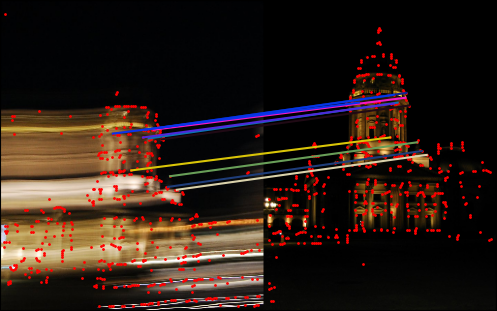

## Description
This is an optimized version of SuperPoint- the popular keypoint detection and description framework. We make two changes to the architecture:
1. We replace the encoder in the original SuperPoint with a lighter MobileNet-v2 encoder
2. The network expects a 3 channel RGB input instead of a grayscale input. To extract features from a grayscale image of shape HxWx1, repeat the image along last dimension to create a HxWx3 input

## Files
1. `model.py` => contains the model definition and the forward function
2. `superpoint_opt.pt` => TorchScript Model
3. `superpoint_opt.pth` => model weights
4. `test.py` => code to test the model

## Testing
1. First install requirements

    `pip install -r requirements.txt`
2. Test the code

    `python test.py` --> saves the results in as `out_matches.png`
<!--## Evaluation on HPatches-->
## Results

## Inference
**Hardware** : 
1. 13th Gen Intel(R) Core(TM) i9-13900K CPU
2. 128GB RAM
3. NVidia RTX 3090 Ti GPU

**Metrics**
|  | **Inference Time on CPU (ms)** | **Inference Time on GPU (ms)** | **Number of parameters (in millions)** | **MAC (In billions)** |
| --- | --- | --- | --- | --- |
| **SuperPoint** | 15.25 | 1.52 | 1.2 | 6.67 |
| **SuperPoint-Opt** | **8.25** | **0.99** | **0.4** | **0.71** |